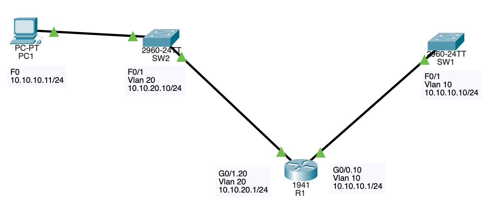

# CCNA Home Lab Portfolio

This repo documents the hands-on networking labs I'm building while studying for the **CCNA (Cisco Certified Network Associate)** certification. It includes physical lab setup, device configurations, verification output, and notes on what I learned/troubleshooted along the way.

## About

I'm currently studying for the CCNA and building a home lab with real Cisco gear to get hands-on practice beyond simulations. This repo is both a study log and a portfolio to show practical, working knowledge of the topics on the CCNA exam blueprint.

- **Status:** Studying for CCNA (in progress)
- **Target exam date:** *2026-09-02*

## Lab Environment

- **Hardware:** 1 Cisco 1941/K9 1941 ISR Integrated Services Router 1900 Series, 1 Cisco Catalyst 2960 series 24 Port PoE Ethernet Switch WS-C2960-24PC-L, 1 Cisco Catalyst 2960S WS-C2960S-24TS-L 24-Port Rack Gigabit Switch Managed
- **Cabling:** Hand-crimped RJ45 Ethernet cables (cut/crimped to custom lengths for the rack)
- **Host:** 1 PC used as management host / TFTP server
- **Access:** Console cable for initial CLI configuration, Ethernet cable for telnet/SSH access

## Topology



```
[Host PC / TFTP Server] --- [Switch 1] --- [Switch 2] --- [Router]
```

## Repo Structure

```
/images    -> Photos and diagrams of physical lab setup
/labs      -> Individual lab writeups and config files
/configs   -> Saved device configuration backups (via TFTP)
```

## Progress Log

### ✅ Physical Setup
- Crimped RJ45 cables to custom lengths for a cleaner physical lab setup
- Connected 1 router and 2 Layer 2 switches into a working topology
- *(photo: see `/images/RJ45 Crimping.jpg`)*

### ✅ Device Recovery
- Performed **password recovery** on the router after forgetting the enable secret
- Performed **password recovery / reset** on a used switch purchased without known credentials

### ✅ IP Addressing & Connectivity
- Configured IP addressing on the router and a host PC
- Verified end-to-end connectivity between host and router

### ✅ TFTP Backup
- Set up a **TFTP server** on the host PC
- Backed up router configuration files to TFTP for safekeeping/version control

### ✅ Switching / Trunking
- Configured **trunking** between switches (802.1Q) since both switches are Layer 2 only and needed to pass VLAN traffic between them

## Skills Demonstrated So Far

- Physical cabling (RJ45 crimping/termination)
- Router and switch password recovery
- Basic IP addressing and host connectivity
- TFTP configuration backup/restore
- VLAN trunking on Layer 2 switches

## CCNA Exam Blueprint Coverage

Tracking progress against the official CCNA exam topics:

- [x] Network Fundamentals (cabling, physical connectivity)
- [x] Basic device access & recovery (password recovery)
- [ ] IP Connectivity (static/dynamic routing)
- [x] IP Services (TFTP)
- [ ] Security Fundamentals
- [x] (Partial) Network Access — VLANs & Trunking
- [ ] Automation and Programmability

## Tools & Resources

- Cisco IOS (physical hardware)
- TFTP server software: *tftpd64*
- Study resources: *Cisco CCNA 200-301: The Complete Guide to Getting Certifieda*

## Contact

- LinkedIn: *www.linkedin.com/in/yulaidi*

